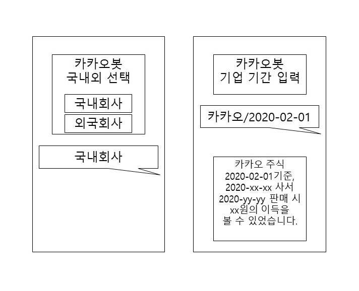
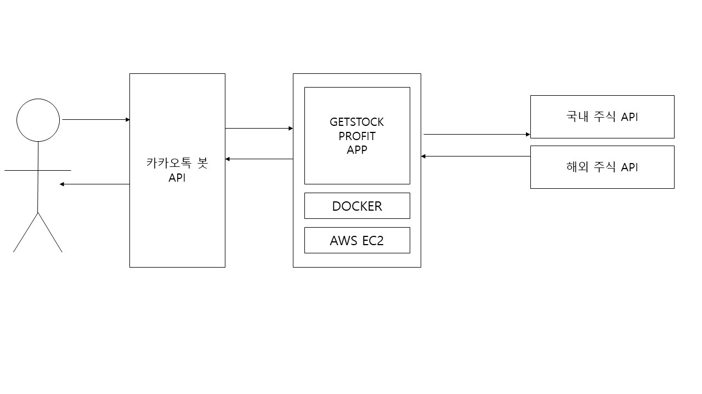

# GetStiockProfit

<table data-layout="default"><colgroup><col style="width: 174.0px;" /><col style="width: 151.0px;" /><col style="width: 435.0px;" /></colgroup>
<tbody>
<tr>
<td data-highlight-colour="#f4f5f7">

프로젝트명
</td>
<td colspan="2">

GetStockProfit(임시)
</td></tr>
<tr>
<td data-highlight-colour="#f4f5f7">

목표
</td>
<td colspan="2">
<ul>
<li>

기능구현
</li>
<li>

사용자가 카카오 봇을 이용해 기업과 날짜를 입력시 최대 이익을 얻을수 있는 매수-매도날짜와 가격을 카카오톡으로 받게 한다.
</li></ul></td></tr>
<tr>
<td data-highlight-colour="#f4f5f7">

프로젝트 기간
</td>
<td colspan="2">

2020-12-01~2020-12-31
</td></tr>
<tr>
<th>

프로젝트 선정이유
</th>
<th data-highlight-colour="#ffffff" colspan="2">

지인들과 코로나 전 K사 주식을 사서 지금 팔면 얼만큼의 이득이 났을지 이야기가 나왔고 이를 계기로 원하는 기간을 설정해서 입력할 경우 언제 매수해서 언제 매도하면 가장 큰 이득을 얻을수 있는지 계산해 카카오톡 봇으로 알려주는 간단한 프로젝트 진행을 하기로 함
</th></tr>
<tr>
<td data-highlight-colour="#f4f5f7" rowspan="4">

사용 기술
</td>
<td>

서비스 개발
</td>
<td>

SpringBoot, REST
</td></tr>
<tr>
<td>

서버 기술
</td>
<td>

AWS, Docker
</td></tr>
<tr>
<td>

CI/CD
</td>
<td>

Git Action
</td></tr>
<tr>
<td>

기타
</td>
<td>

카카오톡 봇 기능

JIRA, Confluence

TEST &ndash; TDD(Junit 5)
</td></tr>
<tr>
<td data-highlight-colour="#f4f5f7">

핵심 기능
</td>
<td colspan="2">
<ol>
<li>

카카오 봇을 통해 일단 기업코드, 기간을 입력받고 외부 주식 API를 통해 기간내 주식 가격을 받아옴
</li>
<li>

기간내 언제 사서 언제 팔면 가장 큰 이득을 얻을 수 있는지 계산 기능
</li>
<li>

카카오 봇을 통해 결과 알려줌
</li>
<li>

Git Action을 이용해 자동 CI/CD환경 구축. 도커로 이미지화
</li></ol></td></tr>
<tr>
<td data-highlight-colour="#f4f5f7" rowspan="3">

참고 URL
</td>
<td>

Jira Link
</td>
<td>

<a href="https://hasi.atlassian.net/secure/RapidBoard.jspa?rapidView=1&amp;projectKey=GSP&amp;selectedIssue=GSP-3">https://hasi.atlassian.net/secure/RapidBoard.jspa?rapidView=1&amp;projectKey=GSP&amp;selectedIssue=GSP-3</a>
</td></tr>
<tr>
<td>

Git Action
</td>
<td>

<a href="https://qu3vipon.github.io/2020/06/28/CI-CD/Github-Actions%EB%A5%BC-%EC%9D%B4%EC%9A%A9%ED%95%9C-%EB%B0%B0%ED%8F%AC-%EC%9E%90%EB%8F%99%ED%99%94/">https://qu3vipon.github.io/2020/06/28/CI-CD/Github-Actions를-이용한-배포-자동화/</a>
</td></tr>
<tr>
<td>

카카오 봇
</td>
<td>

<a href="https://i.kakao.com/docs/getting-started-overview#%EC%98%A4%ED%94%88%EB%B9%8C%EB%8D%94-%EC%86%8C%EA%B0%9C">https://i.kakao.com/docs/getting-started-overview#오픈빌더-소개</a>
</td></tr></tbody></table>

화면 UI

FLOW 차트

